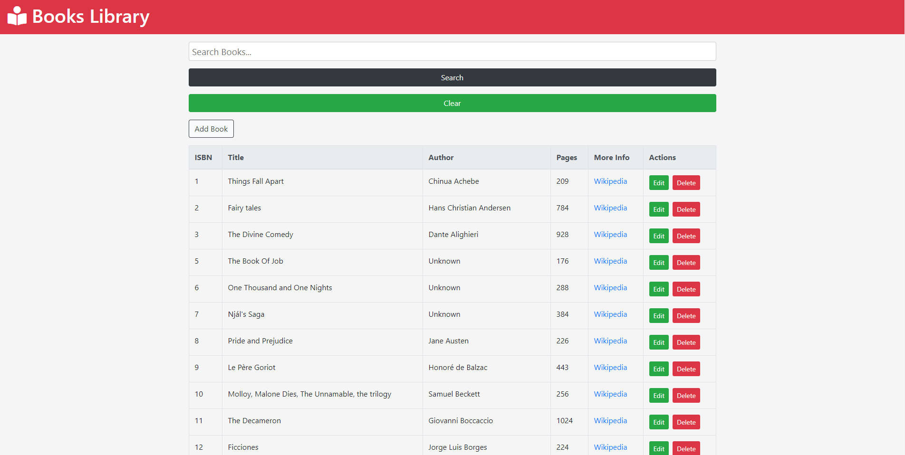

# books-library-using-react
This is a small react app which renders list of books that are available in a fake REST API server along with CRUD functionalities and other features.

- Run the jsonserver file using this command at port 3000:

		npm run json:server
    
    
- Run the books-app using this command at port != 3000:

		npm start
		

